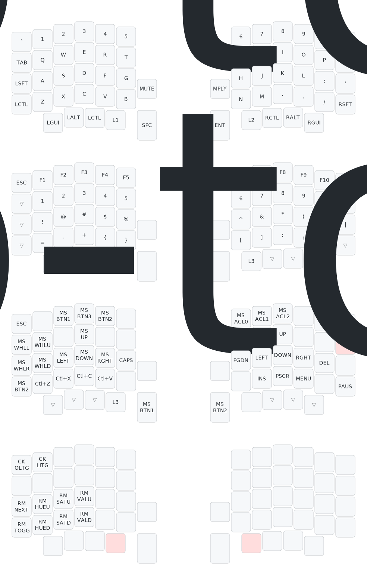
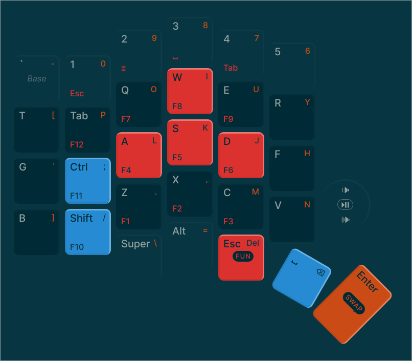

# r58iiz-keyboard-config
QMK/Vial etc etc based config for my keyboard(s)

## Keyboards

- `Mechboards/Sofle Pro`

## Keymaps

- `Mechboards/Sofle Pro/qwerty`
    

- `Mechboards/Sofle Pro/jurf_miryoku`
    

## To Do

- [ ] Automate firmware (uf2) generation:
    - [ ] QMK
    - [ ] Vial
